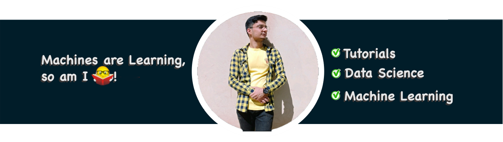

# Hi there 👋 I'm [Amirhassan Amirmahani!](https://hasanm08.github.io/)   
 
## GitHub Portfolio

```
I am deeply passionate about software development, with a special focus on mobile app development using Dart and Flutter. My GitHub profile, hasanm08, showcases my journey in the tech world, highlighting my contributions to the open-source community and my personal projects.
```
## Notable Repositories
```
    Wakelock Plus: A Dart package that provides a simple way to keep the device awake. This project demonstrates my ability to create practical solutions for common mobile app development challenges.

    Sentry Dart: A Dart client for Sentry, a popular error tracking and monitoring tool. This contribution showcases my expertise in integrating third-party services into Flutter applications.

    SPR-Research-Project: A comprehensive research project that showcases my ability to conduct in-depth research and apply my findings in practical applications. This project includes various branches and tags, indicating a structured approach to project management and version control.

    Flutter UI Challenges: A collection of Flutter UI challenges that I've tackled, demonstrating my skills in creating visually appealing and user-friendly interfaces. This project highlights my attention to detail and my ability to implement complex UI designs.

    Deep Learning Projects: A series of projects related to deep learning, showcasing my interest and proficiency in this rapidly evolving field. These projects include various machine learning models and algorithms, demonstrating my commitment to staying at the forefront of technology.
```

## Contributions and Achievements
```
    Active Contributor: I have been actively contributing to various projects, including bug fixes, feature additions, and documentation improvements. My contributions have been recognized by the GitHub community, with several of my pull requests being merged into main projects.

    Open Source Advocate: I am committed to the open-source community, believing in the power of collaboration and sharing knowledge. My contributions to open-source projects have not only enhanced my skills but also contributed to the development community.
```

## Technical Skills
```
    Languages: Proficient in Dart, and Flutter,C# , with a keen interest in deep learning and AI.
    Tools: Currently working on Dart & Flutter, with a focus on improving my skills in Flutter, Agile methodologies, and software development practices.
```
## Contact Information
```
For more details about my projects, contributions, and to connect with me, please visit my GitHub profile at https://github.com/hasanm08 or reach out to me on LinkedIn at https://www.linkedin.com/in/hasanm08/ to find me at social medias https://hasanm08.github.io .
```
 

## Things you should know 
```
Currently working on:AI & Flutter 

Getting better at:Flutter, AI, Agile, Software Development
```
## Github stats
<div align="left">
  </a>
 <b align="right" >
   </a> </b>
</div>


## Github Profile Trophy


[](https://github.com/ryo-ma/github-profile-trophy)

## How to reach Me
 <a href="https://hasanm08.github.io/" target="_blank">
  
  </a>
  <a href="https://www.linkedin.com/in/hasanm08/" target="_blank">
  
  </a>
  <a href="https://stackoverflow.com/users/14041364" target="_blank">
    
  </a>
  <a href="https://twitter.com/hasanm08" target="_blank">
    
  </a>


